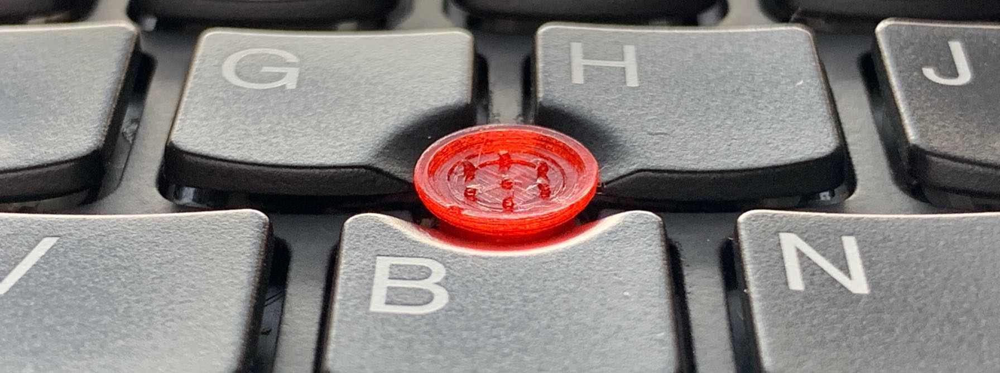
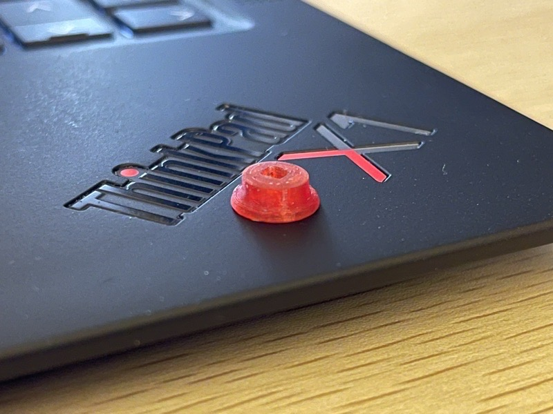
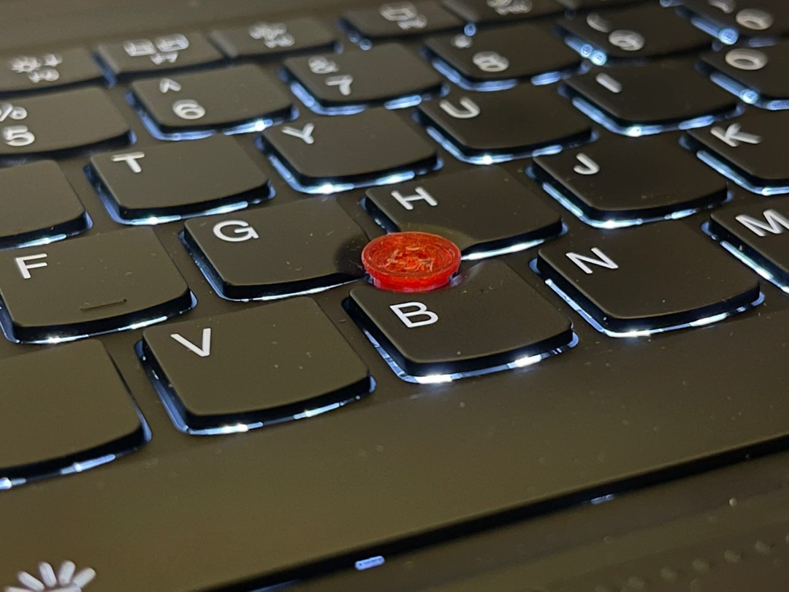
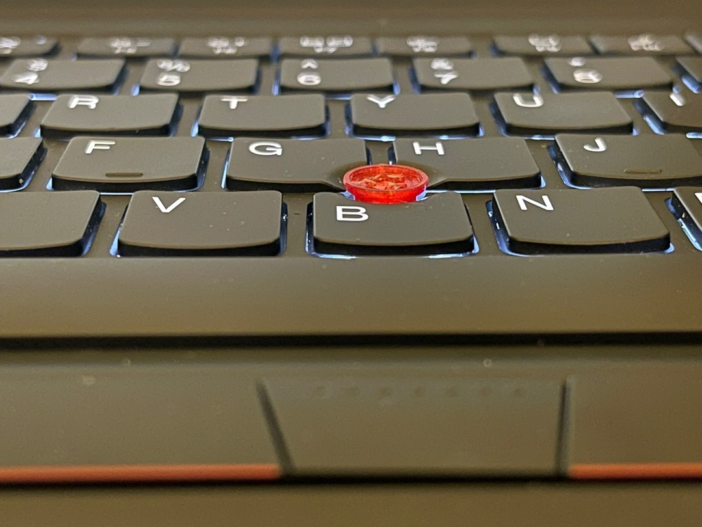

# LKYsSoftRimTrackPoint

## 讓你願意常態性使用的小紅點 ｜ 丟掉滑鼠、丟掉電腦包裡的腫塊 ｜ 耐用

- Easy to daily use ｜ Throw away mouse, away bloated laptop bag ｜ Durable

## Launch our New Version at February 2019！

- 觸感：改善刮手問題，對手指更親合、更具包覆性！
- 操控：改善過於靈敏的問題，操控性更好、指向更穩定，大幅降低 over-shoot，減少手指疲勞！
- 安全：更具[韌性](pictures/SoftRim_TPU_FingerPress.jpg)的材料，安裝與拆卸都更加容易！不必害怕弄斷插銷！
- 外觀：色澤更加鮮紅！與 ThinkPad 更搭配！

## 已知大多數人會用的型號相容性 Compatibility of popular type

### Low Profile(LP)

- ThinkPad X220、X230、T430s、T470、T480、E450、藍牙鍵盤(ThinkPad Bluetooth Keyboard with TrackPoint)、有線鍵盤(ThinkPad Wired USB Keyboard with TrackPoint)

- 官方列表更詳細，清單內可相容
- More detail compatible type, in this official list  
  - <https://accessorysmartfind.lenovo.com/#/products/0A33908>
  - [如果官方連結失效，請看這個備份（backup list）](CompatibleList-LowProfile.md)  

### Super Low Profile(SLP)

- ThinkPad X1 Carbon 4/5/6 Gen
- ThinkPad X1 Yoga 1/2/3 Gen
- ThinkPad T460p/s、T470p/s、T480s、T490/s、T590
- ThinkPad X280、E480、E485、E490、E585、E14
- ThinkPad 13 2nd
- ThinkPad P1、P52、P53
- ThinkPad T14/s

- 官方列表更詳細，清單內可相容
- More detail compatible type, in this official list  
  - <https://accessorysmartfind.lenovo.com/#/products/4XH0L55146>
  - [如果官方連結失效，請看這個備份（backup list）](CompatibleList-SuperLowProfile.md)

### ThinkPad X1 Carbon 7/8/9 Gen 與 X1 Nano 需要打磨過後方可使用

由於我本身沒有這台電腦可以測試，所以仰賴勇敢的幾位網友幫忙測試，得到以下結果：

- 孔洞大小與 SLP 一樣，但高度較低
- 用400號砂紙磨 20 分鐘，就能磨到至少可以用。最後可以用1000號砂紙修飾外表。
- 如果磨的不夠短，蓋上蓋子以後會無法自動休眠
- 該網友提供的參考照片 <https://photos.app.goo.gl/yF3PcBu1QVKfFNjG6>

蝦皮網友dennytung磨好的樣子：

### 已知不可用型號 Incompatible

- ThinkPad X1 Tablet（參考 X1C7，你願意磨更久的話說不定可以用，願意嘗試者可以跟我要半價風險補貼）

---

## Low Profile 與 Super Low Profile 對照圖與比例尺（Scale of Low Profile & Super Low Profile）

---

## 如何安裝？How to setting？

這一代改更具韌性的材質製作，更安全，不會有太緊的問題了，憑直覺安裝即可。

## 哪裡買？Where to buy？

蝦皮（台灣） <https://shopee.tw/mosdeo/1885494569>  
淘寶（大陸） <https://item.taobao.com/item.htm?id=587030319640>  
Etsy（Out of Taiwan or Mainland China） <https://www.etsy.com/listing/666095744/pointing-stick-for-thinkpad-x1>

## 覺得貴嗎？貴就對了！便宜是留給爛大街的凸點。加油！挑剔的人！

## Q & A

Q1：會不會頂到螢幕？  
A1：X1 Carbon 5 Gen 的話，可以保證絕對不會碰到螢幕，因為這是我的日常用機，我們在開發過程也是都用這一款來測試。凹小紅點安裝後與鍵帽同高，且螢幕邊框也比中央顯示區域要凸；X1 Yoga 2 Gen 也是我用過一兩個月的筆電，Yoga 系的鍵盤與小紅點，則是會在螢幕蓋上的過程中一同下沉到 C 件平面中；TP 13 2nd 則是買家回報可用，我本人對 TP 13 2nd 的適用性沒有十足把握。

Q2：有其他顏色嗎？  
A2：上一個版本發現其他顏色太難賣，不做了，這版本只做紅色。

Q3：這一版是不是賣得太貴了！有天理嗎！  
A3：這個問題的回覆很長，所以我另外寫了一篇[「為什麼你該花這麼多錢，購買我們自製的 Soft-Rim 小紅點？」](TooExpensive.md)

Q4-1：问下，有时候小红点用着用着突然明显要加大力度才能拖动，这样正常吗？是不是遥杆有问题？  
Q4-2：有時候放著不動，會慢速飄移，是不是你們家小紅點做的不平整？  
A4：firmware 內部的自動校準，有時候會很笨，這沒辦法改，你用原廠小紅點也會有這個問題。  

Q5：你們說在台中生產的，那可以台中面交嗎？  
A5：除非數量很多並且預付款項，否則不接受面交。因為我們自己有別的工作，之前很多人約面交然後又爽約。  

## 冷知識

- 小紅點是 track point
- 凹的那一種叫 soft rim
- 上面那一顆可以卸下的皮叫做 pointing stick

## 參考連結

《来自LKY的ThinkPad凹小红点动手玩》  
<https://mrzan.xyz/662>

台灣一篇 Blog 詳述了這個問題的來龍去脈  
<https://blog.abev66.tw/2017/12/soft-rim.html> 

《重新爱上小红点 —— LKY 自制 ThinkPad 小红盘使用评测》  
<https://blog.skk.moe/post/lky-softrim/>

《可能，ThinkPad会有原生红学家》  
<https://www.chiphell.com/thread-2222550-1-1.html>

在 ThinkPad 第二代小紅點鍵盤上，使用我們小紅盤的心得  
<https://blog.ericzhuochen.com/post/thinkpad-keyboard-ii/#%E8%BF%9B%E4%B8%80%E6%AD%A5%E5%8D%87%E7%BA%A7soft-rim>